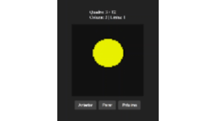

# 🎞️ Animação — Trabalhando com Spritesheet

Este projeto implementa uma animação 2D utilizando **HTML, CSS, JavaScript e Canvas**.

Mais do que construir uma animação funcional, este repositório foi pensado como um material de apoio para estudar um conceito fundamental no desenvolvimento de Jogos Digitais:

> **Um spritesheet reúne vários quadros de uma animação em uma única imagem, e o código seleciona qual desses quadros deve ser exibido a cada momento.**

A partir desse conceito, podemos observar como uma animação em um jogo pode ser construída a partir da combinação de:

```text
             SPRITESHEET
                  ↓
          vários quadros
                  ↓
       seleção de um quadro
                  ↓
             CANVAS
                  ↓
        passagem do tempo
                  ↓
             ANIMAÇÃO
```

---

<p align="center">
  
</p>

---

# 📋 Requisitos do projeto

Antes de observar o código, é importante identificar o que precisamos para construir uma animação.

O projeto deve:

* carregar uma imagem contendo vários quadros;
* identificar quantas linhas e colunas existem nessa imagem;
* calcular o tamanho de cada quadro;
* selecionar um quadro específico;
* desenhar somente esse quadro no `Canvas`;
* permitir avançar para o próximo quadro;
* permitir voltar para o quadro anterior;
* permitir reproduzir e pausar a animação;
* atualizar os quadros de acordo com a passagem do tempo;
* informar visualmente o quadro, a linha e a coluna atualmente utilizados.

No projeto, o spritesheet utilizado é:

```text
animacao_bola.png
```

O código considera que essa imagem possui:

```text
3 colunas
4 linhas
```

Portanto:

```text
3 × 4 = 12 quadros
```

Esses valores são definidos no JavaScript:

```javascript
const colunas = 3;
const linhas = 4;

const totalQuadros = colunas * linhas;
```

O repositório possui atualmente os arquivos `index.html`, `script.js`, `style.css` e `animacao_bola.png`.

---

# 🎮 O que é animação em Jogos Digitais?

Quando pensamos em animação, podemos imaginar um objeto se movimentando continuamente.

Entretanto, uma animação 2D tradicional pode ser entendida de uma maneira mais simples:

> **Uma animação é uma sequência de imagens apresentadas em uma determinada velocidade.**

Por exemplo:

```text
Quadro 1 → Quadro 2 → Quadro 3 → Quadro 4
    ↓          ↓          ↓          ↓
   imagem     imagem     imagem     imagem
```

Quando esses quadros são apresentados rapidamente, nosso sistema visual percebe uma mudança contínua.

Em um jogo, isso pode representar:

* um personagem andando;
* um personagem pulando;
* uma bola quicando;
* uma explosão;
* um ataque;
* uma porta abrindo;
* uma moeda girando;
* um inimigo realizando uma ação.

Neste projeto, utilizamos uma bola como exemplo.

---

# 🖼️ O que é um Spritesheet?

Um **spritesheet** é uma imagem que contém vários quadros de uma animação organizados em uma grade.

Imagine que temos 12 imagens individuais:

```text
┌────────┐ ┌────────┐ ┌────────┐
│Quadro 1│ │Quadro 2│ │Quadro 3│
└────────┘ └────────┘ └────────┘

┌────────┐ ┌────────┐ ┌────────┐
│Quadro 4│ │Quadro 5│ │Quadro 6│
└────────┘ └────────┘ └────────┘

┌────────┐ ┌────────┐ ┌────────┐
│Quadro 7│ │Quadro 8│ │Quadro 9│
└────────┘ └────────┘ └────────┘

┌─────────┐ ┌─────────┐ ┌─────────┐
│Quadro 10│ │Quadro 11│ │Quadro 12│
└─────────┘ └─────────┘ └─────────┘
```

Podemos armazenar tudo isso em uma única imagem:

```text
┌────────┬────────┬────────┐
│   1    │   2    │   3    │
├────────┼────────┼────────┤
│   4    │   5    │   6    │
├────────┼────────┼────────┤
│   7    │   8    │   9    │
├────────┼────────┼────────┤
│  10    │  11    │  12    │
└────────┴────────┴────────┘
```

Essa imagem é o **spritesheet**.

O programa não precisa desenhar a imagem inteira.

Ele pode selecionar apenas uma região:

```text
┌────────┬────────┬────────┐
│        │        │        │
├────────┼────────┼────────┤
│        │   🎯   │        │
├────────┼────────┼────────┤
│        │        │        │
├────────┼────────┼────────┤
│        │        │        │
└────────┴────────┴────────┘
```

E desenhar essa região no `Canvas`.

---

# 🧩 Spritesheet como Asset

Em um projeto de Jogos Digitais, o spritesheet é um tipo de **asset visual**.

Podemos ter diferentes tipos de assets:

| Tipo         | Exemplos                                |
| ------------ | --------------------------------------- |
| 🖼️ Imagem   | sprites, spritesheets, texturas, ícones |
| 🎵 Áudio     | músicas, efeitos sonoros, vozes         |
| 🎬 Vídeo     | cutscenes, vídeos                       |
| 🔤 Fonte     | fontes utilizadas na interface          |
| 🧊 Modelo 3D | personagens, objetos, cenários          |
| ✨ Efeitos    | partículas, shaders, animações          |
| 🗺️ Dados    | mapas, fases, configurações             |

Neste projeto, o principal asset é:

```text
animacao_bola.png
```

O JavaScript é responsável por decidir **qual parte desse asset deve ser apresentada**.

Podemos representar essa relação assim:

```text
                  PROJETO
                     │
          ┌──────────┴──────────┐
          │                     │
        CÓDIGO                ASSET
          │                     │
          │             animacao_bola.png
          │                     │
          ├── calcula quadro    │
          ├── calcula posição   │
          ├── seleciona região  │
          └── desenha           │
                                │
                         vários quadros
```

Essa separação entre **código** e **assets** é muito comum no desenvolvimento de jogos.

---

# 📐 Dividindo o Spritesheet

Para trabalhar com o spritesheet, precisamos descobrir o tamanho de cada quadro.

Imagine que a imagem tenha:

```text
largura total
      ↓
┌────────┬────────┬────────┐
│        │        │        │
│        │        │        │
└────────┴────────┴────────┘
           3 colunas
```

Se a largura da imagem for `768px`:

```text
768 ÷ 3 = 256px
```

Cada quadro terá:

```text
256px de largura
```

Da mesma maneira, se a imagem possuir `1024px` de altura:

```text
1024 ÷ 4 = 256px
```

Cada quadro terá:

```text
256px de altura
```

No código, não precisamos informar esses valores diretamente.

Eles são calculados a partir da própria imagem:

```javascript
const larguraQuadro = imagem.width / colunas;
const alturaQuadro = imagem.height / linhas;
```

Assim:

```text
largura da imagem ÷ número de colunas
                    ↓
             largura do quadro


altura da imagem ÷ número de linhas
                    ↓
              altura do quadro
```

Isso torna o código mais flexível.

---

# 🎯 Selecionando um quadro

Agora temos um problema importante:

> Como o programa sabe onde está o quadro que queremos desenhar?

Para isso, o código utiliza um número para representar o quadro atual:

```javascript
let quadroAtual = 0;
```

É importante perceber que o computador começa a contar a partir de `0`.

Assim:

```text
quadroAtual = 0 → primeiro quadro
quadroAtual = 1 → segundo quadro
quadroAtual = 2 → terceiro quadro
...
quadroAtual = 11 → décimo segundo quadro
```

Embora o usuário veja:

```text
Quadro 1
```

internamente o programa trabalha com:

```text
0
```

Essa diferença é muito comum na programação.

---

# 📍 Quadro, Linha e Coluna

O spritesheet é uma matriz.

Podemos representar suas posições assim:

```text
             COLUNA
          0      1      2
       ┌──────┬──────┬──────┐
 LINHA 0│  0   │  1   │  2   │
       ├──────┼──────┼──────┤
 LINHA 1│  3   │  4   │  5   │
       ├──────┼──────┼──────┤
 LINHA 2│  6   │  7   │  8   │
       ├──────┼──────┼──────┤
 LINHA 3│  9   │ 10   │ 11   │
       └──────┴──────┴──────┘
```

Precisamos transformar:

```text
quadroAtual
```

em:

```text
linha
+
coluna
```

O código faz isso:

```javascript
const coluna = quadroAtual % colunas;
const linha = Math.floor(quadroAtual / colunas);
```

## ➗ Encontrando a coluna

O operador `%` representa o **resto da divisão**.

Por exemplo:

```text
0 % 3 = 0
1 % 3 = 1
2 % 3 = 2
3 % 3 = 0
4 % 3 = 1
5 % 3 = 2
```

Por isso:

```javascript
const coluna = quadroAtual % colunas;
```

produz:

```text
0 → coluna 0
1 → coluna 1
2 → coluna 2
3 → coluna 0
4 → coluna 1
5 → coluna 2
```

A sequência se repete a cada 3 quadros.

## ➗ Encontrando a linha

Para descobrir a linha utilizamos:

```javascript
const linha = Math.floor(quadroAtual / colunas);
```

`Math.floor()` descarta a parte decimal do resultado.

Por exemplo:

```text
0 / 3 = 0       → linha 0
1 / 3 = 0,33    → linha 0
2 / 3 = 0,66    → linha 0

3 / 3 = 1       → linha 1
4 / 3 = 1,33    → linha 1
5 / 3 = 1,66    → linha 1
```

Assim conseguimos transformar um número de quadro em coordenadas dentro da grade.

---

# 🧭 Do quadro para as coordenadas

Depois de descobrir:

```javascript
linha
coluna
```

podemos descobrir onde o quadro começa dentro do spritesheet.

O código utiliza:

```javascript
const origemX = coluna * larguraQuadro;
const origemY = linha * alturaQuadro;
```

Podemos pensar nisso como:

```text
posição X = coluna × largura do quadro

posição Y = linha × altura do quadro
```

Por exemplo, supondo que cada quadro tenha `256px`:

```text
Quadro 0:

coluna = 0
linha = 0

X = 0 × 256 = 0
Y = 0 × 256 = 0
```

Para o quadro 4:

```text
quadroAtual = 4

coluna = 1
linha = 1

X = 1 × 256 = 256
Y = 1 × 256 = 256
```

Portanto, o quadro começa em:

```text
(256, 256)
```

dentro do spritesheet.

---

# 🖌️ Desenhando apenas uma parte da imagem

É aqui que o `Canvas` se torna especialmente interessante.

O método:

```javascript
contexto.drawImage()
```

pode receber informações para definir:

1. qual imagem será utilizada;
2. qual região da imagem será recortada;
3. onde essa região será desenhada;
4. qual será o tamanho final.

No projeto:

```javascript
contexto.drawImage(
    imagem,

    origemX,
    origemY,
    larguraQuadro,
    alturaQuadro,

    0,
    0,
    canvas.width,
    canvas.height
);
```

Podemos separar essa chamada conceitualmente:

```text
                 SPRITESHEET
                      │
                      │
             ┌────────▼────────┐
             │ região escolhida│
             └────────┬────────┘
                      │
                      ▼
                   CANVAS
```

Os quatro primeiros valores depois da imagem representam a região que será recortada:

```javascript
origemX,
origemY,
larguraQuadro,
alturaQuadro
```

Ou seja:

```text
"Pegue esta região do spritesheet"
```

Os quatro valores seguintes representam onde essa região será desenhada:

```javascript
0,
0,
canvas.width,
canvas.height
```

Ou seja:

```text
"Agora desenhe essa região no Canvas"
```

Esse conceito é fundamental para trabalhar com sprites em jogos 2D.

---

# 🖼️ O Canvas representa apenas um quadro

Uma decisão importante deste projeto é que o `Canvas` recebe o tamanho de **um único quadro**:

```javascript
canvas.width = larguraQuadro;
canvas.height = alturaQuadro;
```

Isso significa que o jogador não vê o spritesheet inteiro.

Ele vê somente:

```text
SPRITESHEET
┌────────┬────────┬────────┐
│        │        │        │
├────────┼───🎯───┼────────┤
│        │        │        │
├────────┼────────┼────────┤
│        │        │        │
└────────┴────────┴────────┘

             ↓

          CANVAS

       ┌──────────┐
       │          │
       │    🎯    │
       │          │
       └──────────┘
```

A cada mudança de quadro, outra região do spritesheet é desenhada.

---

# 🔄 Passando de um quadro para outro

A função:

```javascript
function proximoQuadro() {
    quadroAtual++;

    if (quadroAtual >= totalQuadros) {
        quadroAtual = 0;
    }

    desenharQuadro();
}
```

faz três coisas importantes.

### 1. Avança o quadro

```javascript
quadroAtual++;
```

### 2. Verifica se chegou ao final

```javascript
if (quadroAtual >= totalQuadros)
```

### 3. Volta para o início

```javascript
quadroAtual = 0;
```

Isso cria uma animação em loop:

```text
0 → 1 → 2 → 3 → ... → 10 → 11
↑                         ↓
└─────────────────────────┘
```

Quando chegamos ao último quadro, voltamos para o primeiro.

Esse comportamento é conhecido como **loop de animação**.

---

# ⏮️ Voltando para o quadro anterior

O projeto também permite navegar para trás:

```javascript
function quadroAnterior() {
    quadroAtual--;

    if (quadroAtual < 0) {
        quadroAtual = totalQuadros - 1;
    }

    desenharQuadro();
}
```

A lógica é semelhante.

Em vez de aumentar:

```javascript
quadroAtual++;
```

diminuímos:

```javascript
quadroAtual--;
```

E, caso passemos antes do primeiro quadro:

```text
0 → -1
```

voltamos para o último:

```javascript
quadroAtual = totalQuadros - 1;
```

Assim:

```text
0
↑
11 ← 10 ← 9 ← ... ← 2 ← 1
```

---

# ⏱️ Animação depende de tempo

Até agora conseguimos trocar os quadros manualmente.

Mas isso ainda não é uma animação automática.

Para animar, precisamos responder a uma pergunta:

> **Quando devemos trocar para o próximo quadro?**

O projeto define:

```javascript
const duracaoQuadro = 100;
```

Isso significa que o código utiliza um intervalo de aproximadamente:

```text
100 milissegundos
```

entre as mudanças de quadro.

Como:

```text
1000 ms = 1 segundo
```

temos aproximadamente:

```text
1000 ÷ 100 = 10
```

ou seja:

```text
≈ 10 quadros por segundo
```

A velocidade da animação pode ser alterada modificando esse valor.

Por exemplo:

```javascript
const duracaoQuadro = 200;
```

produziria uma troca mais lenta.

Enquanto:

```javascript
const duracaoQuadro = 50;
```

produziria uma troca mais rápida.

Portanto:

```text
menor duração
      ↓
mais trocas por segundo
      ↓
animação mais rápida


maior duração
      ↓
menos trocas por segundo
      ↓
animação mais lenta
```

---

# 🎬 requestAnimationFrame

O navegador fornece uma ferramenta especialmente útil para animações:

```javascript
requestAnimationFrame()
```

O projeto inicia o loop com:

```javascript
requestAnimationFrame(animar);
```

E, dentro da função:

```javascript
function animar(momento) {
    ...
    requestAnimationFrame(animar);
}
```

Isso faz com que o navegador continue chamando a função de animação.

Podemos representar:

```text
requestAnimationFrame
          ↓
       animar()
          ↓
    verifica o tempo
          ↓
   troca o quadro?
      ↙       ↘
    não        sim
     ↓          ↓
  continua   próximo quadro
      \         /
       \       /
        ↓     ↓
 requestAnimationFrame
          ↓
        animar()
```

É importante perceber que o `requestAnimationFrame()` **não significa necessariamente "trocar de quadro agora"**.

Ele significa algo mais próximo de:

> "Execute esta função novamente na próxima oportunidade de atualização da animação."

O próprio código decide se já passou tempo suficiente para trocar de quadro.

---

# ⏳ Controlando o tempo da animação

A função recebe um valor chamado:

```javascript
momento
```

Esse valor representa o momento em que aquela atualização ocorreu.

O projeto também guarda:

```javascript
let ultimoMomentoQuadro = 0;
```

Quando a animação está sendo reproduzida, o código compara:

```javascript
momento - ultimoMomentoQuadro
```

com:

```javascript
duracaoQuadro
```

A condição utilizada é:

```javascript
if (
    estaReproduzindo &&
    momento - ultimoMomentoQuadro >= duracaoQuadro
)
```

Podemos traduzir isso para uma pergunta:

```text
A animação está reproduzindo?
          E
Já passou tempo suficiente
desde o último quadro?
          ↓
        SIM
          ↓
Avança para o próximo quadro
```

Essa é uma ideia importante para o desenvolvimento de jogos:

> **O loop do jogo pode ser executado continuamente, enquanto determinadas ações acontecem somente quando uma quantidade específica de tempo passou.**

---

# ▶️ Reproduzir e parar

O projeto possui uma variável para controlar o estado da animação:

```javascript
let estaReproduzindo = false;
```

Ela funciona como uma espécie de chave:

```text
false → parado
true  → reproduzindo
```

Ao clicar no botão:

```javascript
function alternarReproducao() {
    estaReproduzindo = !estaReproduzindo;
}
```

O operador `!` inverte o valor.

Assim:

```text
false → true
true  → false
```

Podemos visualizar:

```text
             botão
               ↓
       alternarReproducao()
               ↓
        inverte o estado
          ↙          ↘
      false          true
        ↓              ↓
     parado       reproduzindo
```

Essa mesma ideia de **estado** aparece frequentemente em jogos:

```text
personagemVivo
jogoPausado
inimigoAtacando
portaAberta
playerPulando
```

---

# 🧭 Navegação manual

Os botões também permitem controlar a animação manualmente.

O botão **Próximo** chama:

```javascript
proximoQuadro();
```

O botão **Anterior** chama:

```javascript
quadroAnterior();
```

Quando isso acontece, a animação automática é pausada:

```javascript
estaReproduzindo = false;
```

Isso é interessante do ponto de vista didático porque permite observar a animação **quadro a quadro**.

Em vez de apenas assistir ao resultado final:

```text
🎞️ animação
```

podemos investigar sua estrutura:

```text
Quadro 1
   ↓
Quadro 2
   ↓
Quadro 3
   ↓
Quadro 4
   ↓
...
```

Essa é uma maneira prática de compreender como uma animação é construída.

---

# 🧠 Conceitos importantes

Ao estudar este projeto, alguns conceitos merecem atenção especial.

| Conceito                    | O que representa                                       |
| --------------------------- | ------------------------------------------------------ |
| **Sprite**                  | Uma imagem utilizada como elemento visual de um jogo   |
| **Spritesheet**             | Uma imagem que reúne vários sprites ou quadros         |
| **Frame / Quadro**          | Uma imagem individual dentro da sequência de animação  |
| **Linha**                   | Posição vertical do quadro no spritesheet              |
| **Coluna**                  | Posição horizontal do quadro no spritesheet            |
| **Canvas**                  | Área utilizada para desenhar os elementos visualmente  |
| **drawImage()**             | Método utilizado para desenhar a imagem ou parte dela  |
| **requestAnimationFrame()** | Mecanismo do navegador para atualizar animações        |
| **Loop**                    | Repetição de uma sequência de quadros                  |
| **Duração do quadro**       | Tempo utilizado antes da mudança para o próximo quadro |

---

# 🔗 A ideia central: Sprite + Tempo

O ponto mais importante deste projeto é perceber que um spritesheet sozinho **não é uma animação**.

Ele é apenas uma coleção organizada de imagens.

Podemos representar:

```text
              SPRITESHEET
                   │
                   │ contém
                   ↓
           vários QUADROS
                   │
                   │ selecionados por
                   ↓
              PROGRAMAÇÃO
                   │
                   │ utilizando
                   ↓
                 TEMPO
                   │
                   ↓
              ANIMAÇÃO
```

Ou, de maneira ainda mais resumida:

```text
SPRITESHEET
     +
SELEÇÃO DE QUADROS
     +
PASSAGEM DO TEMPO
     ↓
ANIMAÇÃO
```

Essa relação é fundamental para compreender animações 2D em Jogos Digitais.

---

# 🗂️ Organização do projeto

A estrutura atual do repositório é:

```text
animacao/
│
├── index.html
├── script.js
├── style.css
├── animacao_bola.png
└── README.md
```

Cada arquivo possui uma responsabilidade:

```text
index.html
    ↓
estrutura da página


style.css
    ↓
aparência da página


script.js
    ↓
lógica da animação


animacao_bola.png
    ↓
asset visual / spritesheet


README.md
    ↓
material de estudo
```

Essa separação também é uma prática importante no desenvolvimento de projetos.

---

# 🔍 Onde observar no código?

Para estudar o projeto, uma boa sequência de leitura é:

### 1. Carregamento do asset

Procure:

```javascript
const imagem = new Image();
imagem.src = "animacao_bola.png";
```

Pergunta para investigar:

> Como o JavaScript acessa um arquivo externo que faz parte do projeto?

### 2. Configuração do spritesheet

Procure:

```javascript
const colunas = 3;
const linhas = 4;
```

Pergunta:

> Como o programa sabe como a imagem está organizada?

### 3. Cálculo do número de quadros

Procure:

```javascript
const totalQuadros = colunas * linhas;
```

Pergunta:

> Por que multiplicamos linhas e colunas?

### 4. Cálculo da linha e coluna

Procure:

```javascript
const coluna = quadroAtual % colunas;
const linha = Math.floor(quadroAtual / colunas);
```

Pergunta:

> Como transformar um número de quadro em uma posição dentro da matriz?

### 5. Recorte do quadro

Procure:

```javascript
const origemX = coluna * larguraQuadro;
const origemY = linha * alturaQuadro;
```

Pergunta:

> Como descobrir onde o quadro está localizado dentro da imagem?

### 6. Desenho

Procure:

```javascript
contexto.drawImage(...)
```

Pergunta:

> Qual parte da imagem está sendo desenhada?

### 7. Controle do tempo

Procure:

```javascript
momento - ultimoMomentoQuadro >= duracaoQuadro
```

Pergunta:

> Por que não podemos simplesmente trocar de quadro em toda chamada de `requestAnimationFrame()`?

### 8. Loop

Procure:

```javascript
if (quadroAtual >= totalQuadros) {
    quadroAtual = 0;
}
```

Pergunta:

> Como o programa faz a animação voltar ao primeiro quadro?

---

# 🧪 Experimentos sugeridos

Depois de compreender o código, experimente modificar o projeto.

## Experimento 1 — Alterar a velocidade

Modifique:

```javascript
const duracaoQuadro = 100;
```

Experimente:

```javascript
const duracaoQuadro = 500;
```

Depois:

```javascript
const duracaoQuadro = 50;
```

Observe como a percepção da animação muda.

---

## Experimento 2 — Alterar o número de quadros

Altere:

```javascript
const colunas = 3;
const linhas = 4;
```

e observe o que acontece.

**Atenção:** os valores precisam corresponder à organização real do spritesheet.

---

## Experimento 3 — Criar outro spritesheet

Substitua:

```text
animacao_bola.png
```

por outro spritesheet.

Perguntas para investigar:

* Quantas colunas existem?
* Quantas linhas existem?
* Todos os quadros possuem o mesmo tamanho?
* A sequência está organizada por linhas?
* A sequência está organizada por colunas?
* A animação deve fazer loop?

---

## Experimento 4 — Alterar o tamanho do Canvas

No CSS, observe:

```css
canvas {
    width: 256px;
    height: 256px;
}
```

Experimente outros valores.

Observe a diferença entre:

```text
canvas.width
canvas.height
```

no JavaScript e:

```text
width
height
```

no CSS.

---

## Experimento 5 — Criar uma animação diferente

Utilize um spritesheet de:

* personagem andando;
* personagem correndo;
* personagem pulando;
* ataque;
* inimigo;
* objeto girando.

Depois adapte o código para reproduzir a nova animação.

---

# 🎯 Desafios

Depois de entender o funcionamento básico, tente implementar novas funcionalidades.

### Desafio 1 — Controle da velocidade

Crie botões para:

```text
⏪ Mais lento
▶️ Velocidade normal
⏩ Mais rápido
```

---

### Desafio 2 — Barra de progresso

Crie uma barra que represente:

```text
Quadro atual / Total de quadros
```

Por exemplo:

```text
████████░░░░  8 / 12
```

---

### Desafio 3 — Controle por teclado

Permita utilizar:

```text
← Anterior
→ Próximo
Espaço → Reproduzir / Parar
```

---

### Desafio 4 — Diferentes animações

Imagine que o personagem possua:

```text
IDLE
WALK
RUN
JUMP
ATTACK
```

Crie uma forma de selecionar qual animação deve ser reproduzida.

---

### Desafio 5 — Estado do personagem

Crie uma variável:

```javascript
let estado = "idle";
```

E faça o spritesheet utilizado mudar de acordo com o estado:

```text
idle
  ↓
walk
  ↓
run
  ↓
jump
  ↓
idle
```

Esse exercício aproxima o conceito de spritesheet de uma estrutura muito comum em jogos: a **máquina de estados de animação**.

---

# 💡 Para pensar

Durante o estudo deste projeto, tente responder:

> Por que guardar todos os quadros em uma única imagem?

> Como o programa sabe qual quadro deve mostrar?

> Por que precisamos descobrir a linha e a coluna?

> O que aconteceria se o número de colunas estivesse errado?

> Por que `quadroAtual % colunas` ajuda a descobrir a coluna?

> Por que usamos `Math.floor()` para descobrir a linha?

> Qual é a diferença entre o spritesheet e o quadro atualmente exibido?

> Por que a animação precisa considerar o tempo?

> O que aconteceria se o próximo quadro fosse chamado em todas as atualizações do `requestAnimationFrame()`?

> Como a velocidade da animação poderia ser alterada?

Essas perguntas ajudam a passar de uma simples utilização do código para a compreensão do algoritmo.

---

# 🎓 O que este projeto ensina?

Ao finalizar o estudo, o aluno deve ser capaz de compreender que uma animação 2D pode ser construída a partir de uma sequência de imagens.

Mais especificamente, o projeto permite estudar:

* organização de assets;
* sprites e spritesheets;
* sistemas de coordenadas;
* linhas e colunas em uma matriz;
* índices iniciando em `0`;
* operador módulo `%`;
* `Math.floor()`;
* seleção de regiões de uma imagem;
* utilização do `Canvas`;
* método `drawImage()`;
* controle de estado;
* passagem do tempo;
* `requestAnimationFrame()`;
* loop de animação;
* velocidade de reprodução;
* navegação entre quadros.

A ideia principal pode ser resumida em:

```text
ASSET
  ↓
SPRITESHEET
  ↓
QUADROS
  ↓
ÍNDICE DO QUADRO
  ↓
LINHA + COLUNA
  ↓
COORDENADAS
  ↓
RECORTE
  ↓
CANVAS
  ↓
TEMPO
  ↓
PRÓXIMO QUADRO
  ↓
ANIMAÇÃO
```

Ou, de forma ainda mais simples:

```text
imagem
  +
matemática
  +
tempo
  +
código
  ↓
ANIMAÇÃO
```

Esse é um dos fundamentos para compreender como personagens e outros elementos visuais podem ser animados em jogos 2D.
